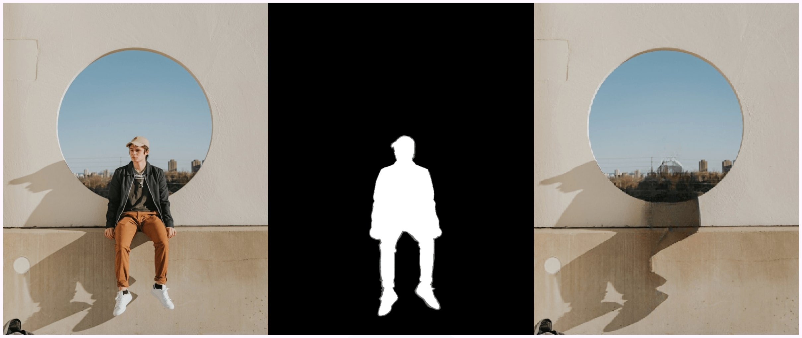

# Flutter - Image Magic Eraser

A Flutter package that removes objects from images using machine learning (LaMa Model).

---

## 🌟 Features

- Remove objects from images using polygon selection or mask images
- Works entirely offline, ensuring privacy and reliability
- Lightweight and optimized for efficient performance
- Simple and seamless integration with Flutter projects

---

## 🔭 Demo


## Getting Started

### 🚀 Installation

Add this package to your Flutter project by including it in your `pubspec.yaml`:

```yaml
dependencies:
  image_magic_eraser: ^latest_version
```

Then run:

```bash
flutter pub get
```

### 📁 Model Setup

1. Download the LaMa model file (`lama_fp32.onnx`) from this url [Carve/LaMa-ONNX](https://huggingface.co/Carve/LaMa-ONNX/tree/main) and place it in your assets folder.

2. Update your `pubspec.yaml` to include the model:

```yaml
flutter:
  assets:
    - assets/models/lama_fp32.onnx
```

## 📚 Usage

### Initialize the Service

Before using the inpainting functionality, you need to initialize the ONNX runtime with the LaMa model:

```dart
import 'package:image_magic_eraser/image_magic_eraser.dart';

// Initialize the service with the model path
await InpaintingService.instance.initializeOrt('assets/models/lama_fp32.onnx');

```

### Method 1: Inpainting with a Mask Image

If you have a separate mask image (white areas will be inpainted):

```dart
// Load your image and mask as Uint8List
final Uint8List imageBytes = await File('path_to_image.jpg').readAsBytes();
final Uint8List maskBytes = await File('path_to_mask.jpg').readAsBytes();

// Perform inpainting
final ui.Image result = await InpaintingService.instance.inpaint(imageBytes, maskBytes);

// Use the result in your UI
// For example, display it in a RawImage widget:
RawImage(
  image: result,
  width: 400,
)
```

### Method 2: Inpainting with Polygons

Define areas to inpaint using polygons (each polygon is a list of points):

```dart
// Load your image as Uint8List
final Uint8List imageBytes = await File('path_to_image.jpg').readAsBytes();

// Define polygons to inpaint (areas to remove)
final List<List<Map<String, double>>> polygons = [
  // Rectangle to remove an object
  [
    {'x': 230.0, 'y': 300.0},
    {'x': 430.0, 'y': 300.0},
    {'x': 430.0, 'y': 770.0},
    {'x': 230.0, 'y': 770.0},
  ],
  // Triangle to remove another object
  [
    {'x': 700.0, 'y': 100.0},
    {'x': 900.0, 'y': 100.0},
    {'x': 800.0, 'y': 300.0},
  ],
];

// Perform inpainting with polygons
final ui.Image result = await InpaintingService.instance.inpaint(
  imageBytes,
  polygons,
);

// Use the result in your UI
```

### Visualizing Masks (Debug)

You can visualize how the mask will look before inpainting:

```dart
// Generate a debug visualization of the mask
final Image debugMask = await InpaintingService.instance.generateDebugMask(
  imageBytes,
  polygons,
  backgroundColor: Colors.transparent,
  fillColor: Colors.red.withOpacity(0.5),
  drawOutline: true,
);

// Display the debug mask (e.g., in a Stack with the original image)
Stack(
  alignment: Alignment.center,
  children: [
    Image.memory(imageBytes),
    debugMask,
  ],
)
```

## 📱 Complete Example

Check out the Example app


## 📝 Notes

- The LaMa model works best with images that have a clear foreground and background.
- For optimal results, ensure that your polygons completely cover the object you want to remove.
- Processing large images may take time, especially on older devices.
- The quality of inpainting depends on the complexity of the image and the area being inpainted.