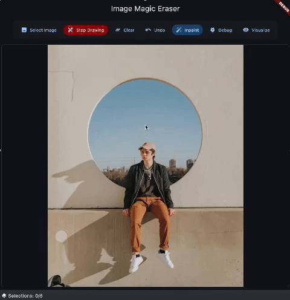

# Flutter - Image Magic Eraser

A Flutter package that removes objects from images using machine learning (LaMa Model).

---

## 🌟 Features

- Remove objects from images using polygon selections
- Works entirely offline, ensuring privacy and reliability
- Lightweight and optimized for efficient performance
- Simple and seamless integration with Flutter projects
- Interactive polygon drawing widget for easy object selection

---

## 🔭 Demo


## Getting Started

### 🚀 Installation

Add this package to your Flutter project by including it in your `pubspec.yaml`:

```yaml
dependencies:
  image_magic_eraser: ^latest_version
```

Then run:

```bash
flutter pub get
```

### 📁 Model Setup

1. Download the LaMa model file (`lama_fp32.onnx`) from this url [Carve/LaMa-ONNX](https://huggingface.co/Carve/LaMa-ONNX/tree/main) and place it in your assets folder.

2. Update your `pubspec.yaml` to include the model:

```yaml
flutter:
  assets:
    - assets/models/lama_fp32.onnx
```

## 📚 Usage

### Initialize the Service

Before using the inpainting functionality, you need to initialize the ONNX runtime with the LaMa model:

```dart
import 'package:image_magic_eraser/image_magic_eraser.dart';

// Initialize the service with the model path
await InpaintingService.instance.initializeOrt('assets/models/lama_fp32.onnx');
```

### Model Loading State Management

The package provides a way to track the model loading state, which is particularly useful since model loading can take some time depending on the device. You can listen to state changes and update your UI accordingly:

```dart
// Get current loading state
ModelLoadingState currentState = InpaintingService.instance.modelLoadingState;

// Listen to state changes
InpaintingService.instance.modelLoadingStateStream.listen((state) {
  switch (state) {
    case ModelLoadingState.notLoaded:
      // Model needs to be loaded
      break;
    case ModelLoadingState.loading:
      // Show loading indicator
      break;
    case ModelLoadingState.loaded:
      // Model is ready to use
      break;
    case ModelLoadingState.error:
      // Show error message
      break;
  }
});

// Example usage in a StatefulWidget
class _MyWidgetState extends State<MyWidget> {
  StreamSubscription<ModelLoadingState>? _modelLoadingSubscription;

  @override
  void initState() {
    super.initState();
    // Subscribe to model loading state changes
    _modelLoadingSubscription = 
        InpaintingService.instance.modelLoadingStateStream.listen((state) {
      setState(() {
        // Update UI based on state
      });
    });
  }

  @override
  void dispose() {
    _modelLoadingSubscription?.cancel();
    super.dispose();
  }

  @override
  Widget build(BuildContext context) {
    final modelState = InpaintingService.instance.modelLoadingState;
    
    return modelState == ModelLoadingState.loading
        ? const CircularProgressIndicator()
        : modelState == ModelLoadingState.loaded
            ? const Text('Ready to use')
            : const Text('Model not loaded');
  }
}
```

### Method : Inpainting with Polygons 

Define areas to inpaint using polygons (each polygon is a list of points):

```dart
// Load your image as Uint8List
final Uint8List imageBytes = await File('path_to_image.jpg').readAsBytes();

// Define polygons to inpaint (areas to remove)
final List<List<Map<String, double>>> polygons = [
  // Rectangle to remove an object
  [
    {'x': 230.0, 'y': 300.0},
    {'x': 430.0, 'y': 300.0},
    {'x': 430.0, 'y': 770.0},
    {'x': 230.0, 'y': 770.0},
  ],
  // Triangle to remove another object
  [
    {'x': 700.0, 'y': 100.0},
    {'x': 900.0, 'y': 100.0},
    {'x': 800.0, 'y': 300.0},
  ],
];

// Perform inpainting with polygons
final ui.Image result = await InpaintingService.instance.inpaint(
  imageBytes,
  polygons,
);

// Convert ui.Image to Uint8List if needed
final ByteData? byteData = await result.toByteData(format: ui.ImageByteFormat.png);
final Uint8List outputBytes = byteData!.buffer.asUint8List();

// Use the result in your UI
Image.memory(outputBytes)
```

### Using the ImageMaskSelector

The package includes an interactive polygon drawing widget that makes it easy for users to select areas to inpaint:

```dart
// Create a controller for the polygon drawing widget
final imageSelectorController = ImageSelectorController();

// Set up the widget in your UI
ImageMaskSelector(
  controller: imageSelectorController,
  child: Image.memory(imageBytes),
),

// When ready to inpaint, get the polygons from the controller
final polygonsData = imageSelectorController.polygons
    .map((polygon) => polygon.toInpaintingFormat())
    .toList();

// Perform inpainting with the drawn polygons
final result = await InpaintingService.instance.inpaint(
  imageBytes,
  polygonsData,
);
```

### Visualizing the Inpainting Process (Debug)

You can visualize the steps of the inpainting process for debugging:

```dart
// Generate debug images for the inpainting process
final debugImages = await InpaintingService.instance.generateDebugImages(
  imageBytes,
  polygonsData,
);

// Display the debug images
// Each key in the map represents a step in the process:
// 'original', 'cropped', 'mask', 'resized_image', 'resized_mask',
// 'inpainted_patch_raw', 'inpainted_patch_resized', 'inpainted_patch', 'blended'
RawImage(
  image: debugImages['mask'],
  fit: BoxFit.contain,
)
```

## 📱 Complete Example

Check out the Example app in the repository for a full implementation.

## 📝 Notes

- The LaMa model works best with images that have a clear foreground and background.
- For optimal results, ensure that your polygons completely cover the object you want to remove.
- Processing large images may take time, especially on older devices.
- The quality of inpainting depends on the complexity of the image and the area being inpainted.
- The polygon drawing widget automatically handles coordinate conversion between screen and image space.